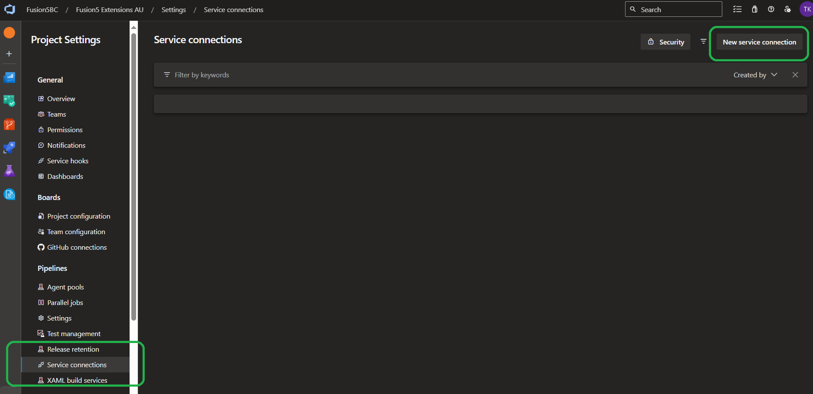

# Connect your Azure DevOps with your BCDevOps Flows repository

To be able to use scripts from your forked/cloned repository, you must connect Azure DevOps with your GitHub repository.

## Create GitHub Personal Access Token (PAT)

To create a public clone you can fork the the main repository.

1. Navigate to your copy of BCDevOps Flows repository.
2. Click (your profile) -> "Settings"
    
3. Select from menu "Developer settings" (the last option in the left menu)
4. Select "Personal Access Tokens" -> "Fine-grained Tokens" -> "Generate new token"
    
5. Specify token name, expiration and access level (if the GitHub repository is public, leave the standard option, if private, select the repository to allow access with the token).
    
5. Copy and save the token (you won't be able to see it again once you leave the page!)

### Create Service Connection in your Azure DevOps project

1. Open your Azure DevOps project and navigate to project settings.
2. Select "Service Connections" from the left menu and use "New service connection" button.
    
3. Select "GitHub" from the list of available services.
4. Change the connection to "Personal Access Token".
5. Paste the PAT you created in the previous section.
6. Name the service connection. You will use this value later in yaml files.
7. You can grant access to this to all pipelines as it does not contain any secrets or secure content.
    
