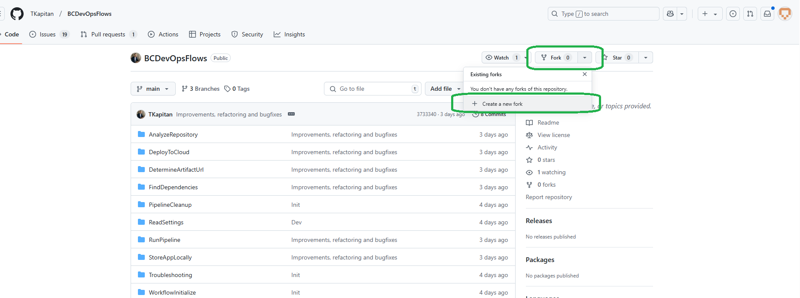

# Fork BCDevOps Flows repository

To start using BCDevOps flow you first need to clone the repository to your GitHub account. You have two ways depending if the cloned repository should be public or private.

## Public Clone

To create a public clone you can fork the the main repository.

1. First, open BCDevOpsFlows repository (https://github.com/TKapitan/BCDevOpsFlows). 
2. Click "Fork" -> "Create a new fork"
    
3. Change the name of the repository if needed and untick the option to copy only the main branch (in case you want to use the preview branch for your pipelines)
    
4. Click "Create fork" and you are done!

### Update cloned public repository

1. To update existing repository, go to BCDevOpsFlows repository (https://github.com/TKapitan/BCDevOpsFlows).
2. Select the branch you want to update (main or preview)
3. Click on "Sync fork" and confirm the dialog
    

## Private Clone

Private clone is a bit more complicated to create and maintain, but gives you more control and privacy. You can not use fork to create private clone.

1. Create a new private repository in GitHub
2. Clone the BCDevOps Flows repository and push it as a mirror to your private repository.
    ```shell
    git clone --bare https://github.com/TKapitan/BCDevOpsFlows
    cd BCDevOpsFlows.git
    git push --mirror https://github.com/yourname/private-repo.git
    cd ..
    rm -rf BCDevOpsFlows.git
    ```
    
### Update cloned private repository

1. Open the local version of your private repository.
2. (only for the first time) add a new remote target for the public (BCDevOps Flows) repository
3. Pull changes from public and push them to your private repository.
4. Repeat previous step for all branches you want to update (main, preview)
    ```shell
    cd private-repo
    git remote add public https://github.com/TKapitan/BCDevOpsFlows
    git pull public master # Creates a merge commit
    git push origin master
    ```