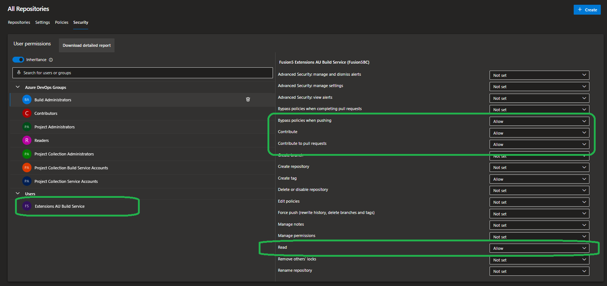

# Build Service Permissions (Project Level)

Build Service is a special account in Azure DevOps that is used when interacting with Azure DevOps from pipelines. In BC DevOps Flows it includes actions such as pushing updated versions back to Azure DevOps.

Every project has its own Build Service, meaning the permission is always managed per-project.

1. Open Azure DevOps project
1. Navigate to "**Project Settings**"
1. "**Repos**" -> "**Repositories**" -> "**Security**"
1. Select the build user from the list and make sure that at least the following roles are set to **Allowed**
     - Bypass policies when pushing
     - Contribute
     - Contribute to pull request
     - Read

If you want to use the SetupPipeline to create and manage pipelines (recommended), you must grant the Build Service account permissions to create and delete build pipelines. 

1. Open Azure DevOps project
1. Navigate to "**Pipelines**"
1. In the top right corner, click on three dots -> "**Manage Security**"
1. Select the build user from the list and make sure that at least the following roles are set to **Allowed**
     - Create build pipeline
     - Delete build pipeline

Both permissions are needed when running the SetupPipelines as pipelines are recreated automatically in SetupPipelines pipeline.

**SECURITY WARNING: We recommend to assign the permission only for limited time when running the SetupPipelines pipeline and remove it after the pipelines are configured.**